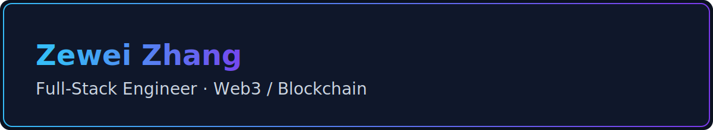

## 🚀 About Me

I'm a passionate **Full-Stack Engineer** with **8+ years** of experience in building scalable web applications, Web3 DApps, and innovative blockchain solutions. Based in **Chengdu, China**, I specialize in bridging traditional web development with cutting-edge blockchain technology.

### 💼 Professional Background
- 🏢 Currently working at **57blocks** as a **Full-Stack Engineer**
- 🌐 Rich experience in front-end development, SEO improvement, responsive layout and front-end architecture design
- ⛓️ Proficient in Web3 front-end development, including DApp development, wallet integration, and smart contract interactions
- 📜 Experienced in Solidity development for EVM-compatible smart contracts
- 🐧 Strong background in Node.js scripting for blockchain state monitoring and trading strategies

- 🔭 I'm currently working on **Web3 DApps and full-stack applications at 57blocks**
- 🌱 I'm currently learning **Advanced Web3 technologies and Smart Contract optimization**
- 👯 I'm looking to collaborate on **Web3 projects and innovative blockchain solutions**
- 💬 Ask me about **React, Web3, Solidity, Node.js, and Front-end Architecture**
- 📫 How to reach me: **453646474@qq.com**
- ⚡ Fun fact: **I specialize in bridging traditional web development with cutting-edge blockchain technology!**

## 🛠️ Tech Stack

### Programming Languages


### Frontend Development


### Backend Development


### Databases


### Cloud & DevOps


### Web3 & Blockchain


### Tools & Platforms


## 📊 GitHub Stats

<div align="center">
  
  
</div>

<div align="center">
  
</div>

## 🏆 GitHub Trophies

<div align="center">
  
</div>

## 📈 Activity Graph

<div align="center">
  
</div>

## 🎯 Current Focus

```javascript
const zhangzewei = {
    currentFocus: ["Web3 Development","Full-Stack Engineering","Smart Contract Development"],
    technologies: {
        "frontend": [
                "React",
                "Vue.js",
                "TypeScript",
                "Next.js"
        ],
        "backend": [
                "Node.js",
                "Python",
                "Java",
                "Go"
        ],
        "databases": [
                "PostgreSQL",
                "MongoDB",
                "Redis"
        ],
        "cloud": [
                "AWS",
                "Docker",
                "Kubernetes"
        ],
        "tools": [
                "Git",
                "Jenkins",
                "Docker",
                "VS Code"
        ]
},
    architecture: ["Microservices","Event-Driven","Serverless"],
    currentlyLearning: ["Advanced Solidity Patterns","Layer 2 Solutions","Cross-chain Development"],
    goals2024: ["Contribute to Web3 Ecosystem","Master DeFi Protocols","Build Innovative DApps"]
};
```

## 🌟 Featured Projects

### 📱 [Story Protocol - Public Domain IP](https://github.com/storyprotocol/public-domain-beta)
> **Web3 IP Management Platform - A decentralized platform for intellectual property management**
- 🚀 Built with React, TypeScript, PostgreSQL, Node.js, Dynamic Wallet
- 🎨 Metamask wallet integration with Dynamic
- 🎨 IP minting and exploration functionality
- 🎨 Database design and data import automation
- 🎨 Public domain IP creation hub

### 🛒 [Soul Wallet - Elytro](https://github.com/Elytro-eth/Elytro)
> **Web3 Wallet Extension - Smart contract wallet with advanced authentication**
- 🚀 Built with React, TypeScript, Viem, shadcn/ui, WebAuthn
- 🎨 Multi-device login with WebAuthn authentication
- 🎨 Chrome extension DApp communication (EIP-6369)
- 🎨 Transaction signing and history management
- 🎨 Account and network switching functionality

### 🤖 [Stellar Resource Usage Report](https://github.com/57blocks/stellar-resource-usage-report)
> **Blockchain Analytics Tool - JavaScript library for Stellar network resource calculation**
- 🚀 Built with TypeScript, Node.js, Stellar SDK
- 🎨 Resource usage calculation for Stellar network
- 🎨 Decorator pattern implementation for client management
- 🎨 Comprehensive testing suite with tutorial guides
- 🎨 SDK integration for blockchain resource monitoring

### 🌐 [Dolphin & ChainSpan - Web3 Hackathon](https://github.com/57blocks/dolphin_ui)
> **DeFi IP Token Platform - Account abstraction and smart contract interaction platform**
- 🚀 Built with React, Next.js, Wagmi, Alchemy, GraphQL
- 🎨 Dynamic wallet connection for DApp integration
- 🎨 Account Abstraction Smart Account with Alchemy
- 🎨 IP token transaction chain with Wagmi
- 🎨 Subgraph data recording and GraphQL queries


## 🧑‍💻 Work Experience

### 57blocks — Full-Stack Engineer (2023-08 - Present)
- 📍 Chengdu, China (Remote)
- 🔗 Key Projects: Story Protocol - Public Domain IP, Soul Wallet - Elytro, Stellar Resource Usage Report, Dolphin & ChainSpan - Web3 Hackathon
- • Led front-end architecture and SEO improvements across multiple products
- • Delivered Web3 DApps with wallet integrations (Dynamic, MetaMask), account abstraction, and on-chain interactions
- • Implemented Node.js automation for blockchain monitoring and data ingestion
- • Built Stellar resource usage analytics library with comprehensive test coverage
- • Contributed to Chrome extension wallet (Elytro) with WebAuthn and EIP-6369 messaging


## 🎓 Education

### Chengdu University — B.S. in Software Engineering (2014-09 - 2018-06)
- • Coursework: Data Structures, Computer Networks, Database Systems, Software Engineering
- • Activities: Programming contests and open-source contributions


## 📊 This Week I Spent My Time On

<!--START_SECTION:waka-->
```text
TypeScript   8 hrs 32 mins   ████████████░░░░░░░░░░░░░   48.2%
React        4 hrs 15 mins   ████████░░░░░░░░░░░░░░░░░   24.1%
Python       2 hrs 18 mins   ████░░░░░░░░░░░░░░░░░░░░░   13.0%
CSS          1 hr 25 mins    ████░░░░░░░░░░░░░░░░░░░░░   8.1%
Other        1 hr 10 mins    ██░░░░░░░░░░░░░░░░░░░░░░░   6.6%
```
<!--END_SECTION:waka-->

## 🤝 Let's Connect

<div align="center">
  
[](https://www.linkedin.com/in/%E6%B3%BD%E7%8E%AE-%E5%BC%A0-b459a527a/)
[](https://x.com/Zhang_Ze_Wei)
[](mailto:453646474@qq.com)
[](https://juejin.cn/user/61228379547288)

</div>

---

<div align="center">
  
  
  ### Thanks for visiting! 😊
  
  
</div>